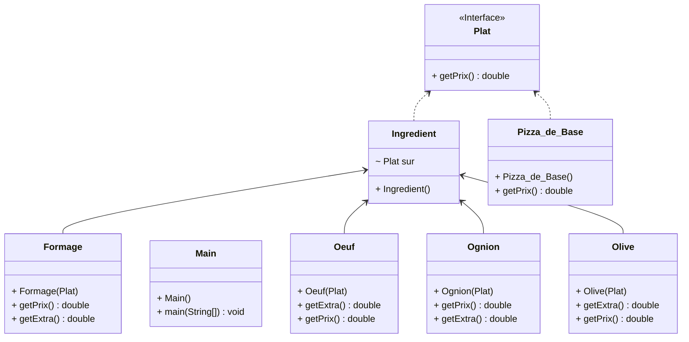

# Design Pattern Decorateur

```mermaid


classDiagram
direction BT
class Formage {
  + Formage(Plat) 
  + getPrix() double
  + getExtra() double
}
class Ingredient {
  + Ingredient() 
  ~ Plat sur
}
class Main {
  + Main() 
  + main(String[]) void
}
class Oeuf {
  + Oeuf(Plat) 
  + getExtra() double
  + getPrix() double
}
class Ognion {
  + Ognion(Plat) 
  + getPrix() double
  + getExtra() double
}
class Olive {
  + Olive(Plat) 
  + getExtra() double
  + getPrix() double
}
class Pizza_de_Base {
  + Pizza_de_Base() 
  + getPrix() double
}
class Plat {
<<Interface>>
  + getPrix() double
}

Formage  -->  Ingredient 
Ingredient  ..>  Plat 
Oeuf  -->  Ingredient 
Ognion  -->  Ingredient 
Olive  -->  Ingredient 
Pizza_de_Base  ..>  Plat 

```